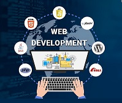

## Présentation du BTS SIO 

**BTS SIO ( Service Informatique aux organisation ).** C'est une formation qui se déroule sur **2 ans.**

Dans cette formation, on étudie trois grands axes qui sont :

    Le développement
   

     Le réseaux

  

    La cybersécurité

## Options du BTS 

### Ce BTS ce construit autour de 2  options :

**Option A : SISR (Solutions d'Infrastructure, Systèmes et Réseau) :**

Cette option permet d’approfondir le système informatique. La conception et l'administration d'un réseau informatique, d'un serveur en passant par l'administration et la supervision du réseau

**Pour plus d'information sur l'option SISR [cliquez-ici](https://www.onisep.fr/ressources/univers-formation/Formations/Post-bac/bts-services-informatiques-aux-organisations-option-a-solutions-d-infrastructure-systemes-et-reseaux)**

**Option B : SLAM (Solution Logicielles et Applications Métier) :**

Cette option permet d'approfondir le développement. La conception, développement des applications.

**Pour plus d'information sur l'option SLAM [cliquez-ici](https://www.onisep.fr/ressources/univers-formation/Formations/Post-bac/bts-services-informatiques-aux-organisations-option-b-solutions-logicielles-et-applications-metiers)**
