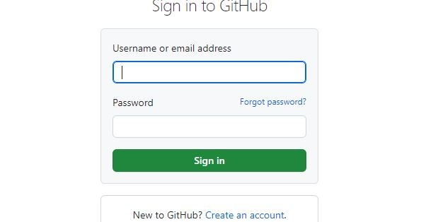
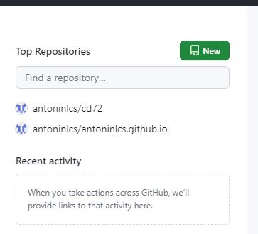
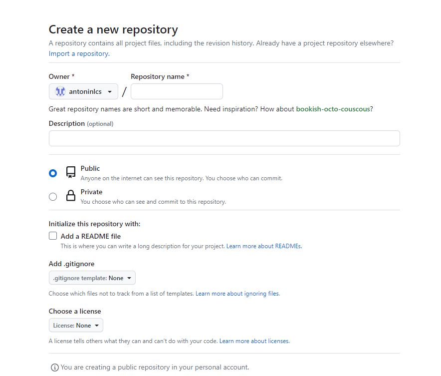

#  Création d'un dépôt **GITHUB** pour héberger mon Portfolio

## Comment crée un dépot GITHUB 

Tout d'abord il faudra vous rendre sur ce site : [GITHUB](https://github.com/)

Il faudra vous connectez avec vos codes fourni aux préalables :

Une fois connecté il faudra **Cliquer sur new en haut à droite de la page**

Ensuite renseigner les informations suivante :

ùmkldzp,nn  no