# Mission Semaine 6/06 au 8/06

#### Installation SRV-DOCK et Registry Docker 

## Registry Docker c’est quoi ?

**Le registre Docker est une méthode standard de stockage et de distribution des images Docker. Le registre est un référentiel open source sous licence d'autorisation Apache. Le registre Docker permet également d'améliorer le contrôle d'accès et la sécurité des images Docker stockées dans son référentiel.**

## Installation SRV-TST-DOCKER :

Pour installer le serveur, je l’ai fait sur l’outil de virtualisation VMWARE. L’installation c’est fait grâce à des scripts ansible ce qui permet une installation rapide et automatique. 

## Installation Registry docker 

Création du Registry privé :

~~~bash
“docker run -d -p 5000:5000 --restart=always --name mon-registry registry:2”
~~~

### Déposer une image dans le Registry privé : 

Tout d’abord il faudra créer un DockerFile :

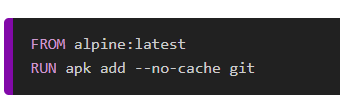

Ensuite il faudra construire votre image : 

Ensuite, il faudra tag votre image pour pouvoir push l’image sur le registry docker 

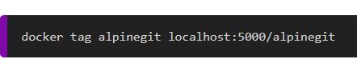

Enfin vous pourrez push votre image dans votre registry :

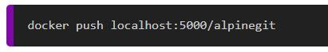

## Visualiser les images disponibles dans le Registry privé:

Voici l’url pour y accèder : 

[Lien pour acceder au registry](http://srv-tst-dock.cg72.fr:5000/v2/_catalog)

Voici ce que vous aurez comme résultat : 

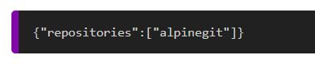

## Visualiser les différents tags d'une image dans le Registry privé : 

Pour l’exemple, nous allons rajouter un tag “test” à notre image “alpinegit” :

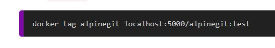

Voici la commande donc pour visualiser les tags :

[Visualiser les tag](http://srv-tst-dock.cg72.fr:5000/v2/alpinegit/tags/list)

Voici le résultat : 

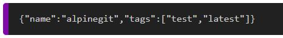

## Le stockage dans un Registry Docker :

C’est important d’avoir un stockage car le problème est que si vous quitter votre docker tous seront supprimer, c’est pour cela qui faut créer des volumes.

Tout d’abord, il faudra créer un dossier : 

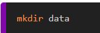

Ensuite lancer un docker avec le paramètre qui sera pris en compte :

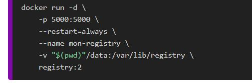

### Attention

**Pensez à supprimer votre précèdent docker**

## Le chiffrement :

Tout d’abord, il faudra créer un dossier pour stocker vos certificats :

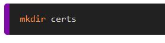

Ensuite, il faudra générer vos certificats auto-signée avec l’outil openssl :

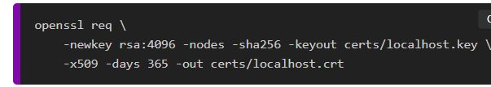

Ensuite créer un docker avec ces paramètres : 
 
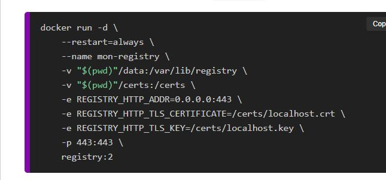

Et vous pourrais refaire la manip du début c’est-à-dire tag et push vos images.

Pour accéder à la page pour voir quoi contient votre registry : [Lien pour voir ce que contient le registry](https://srv-tst-dock.cg72.fr/v2/_catalog)

## Restriction d'accès : 

Il faudra tout d’abord, créer un dossier pour stocker vos fichiers :

Ensuite il faudra générer le fichier htpasswd : 

Ensuite vous pourrez recréer un docker avec tous les paramètres vus depuis le début

Ensuite vous vous connectez à votre registry avec cette commande : 

Une fois que vous êtes log vous pouvez push vos images :

Docker Compose :

Normalement, si vous avez tout bien fait vous devriez avoir cette arborescence :

Vous pouvez inscrire toutes ces fonctionnalités dans un docker Compose : 

