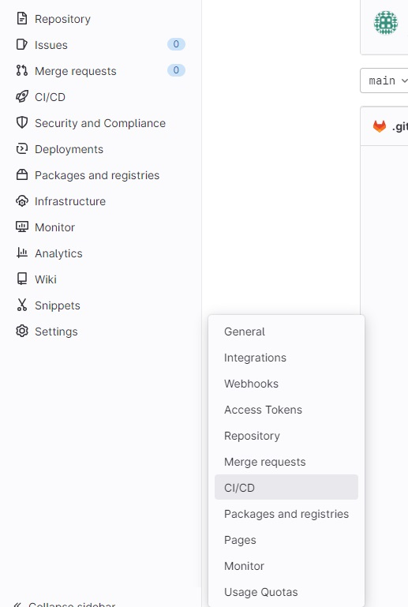
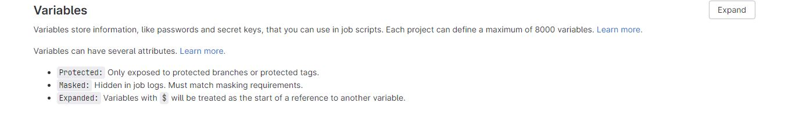
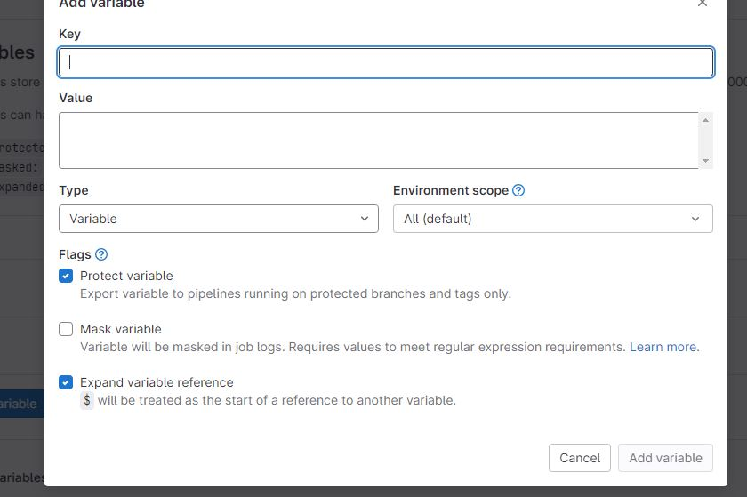

# Push image docker sur votre registry dans GitLab 

**Cela va vous permettre en faisant un "push" d'une image docker sur votre dépôt elle va se stocker dans votre registry.**

## Création du .gitlab-ci.yml

Dans votre dépot créer en amont ([Revoir GITLAB](https://antoninlcs.github.io/cd72/Stage%20CD%2072/Mission/GITLAB/))

Il faudra faire un :

~~~bash

vim .gitlab-ci.yml

~~~

Ensuite il faudra mettre ceci ( Pour l'instant c'est en période de test ) : 

~~~bash

image: docker:20.10.16

variables:
  # When you use the dind service, you must instruct Docker to talk with
  # the daemon started inside of the service. The daemon is available
  # with a network connection instead of the default
  # /var/run/docker.sock socket. Docker 19.03 does this automatically
  # by setting the DOCKER_HOST in
  # https://github.com/docker-library/docker/blob/d45051476babc297257df490d22cbd806f1b11e4/19.03/docker-entrypoint.sh#L23-L29
  #
  # The 'docker' hostname is the alias of the service container as described at
  # https://docs.gitlab.com/ee/ci/services/#accessing-the-services.
  #
  # Specify to Docker where to create the certificates. Docker
  # creates them automatically on boot, and creates
  # `/certs/client` to share between the service and job
  # container, thanks to volume mount from config.toml
  DOCKER_TLS_CERTDIR: "/certs"

services:
  - docker:20.10.16-dind

before_script:
  - docker info

build:
  stage: build
  tags:
    - docker
  before_script:
    - docker login -u $user -p $mdp https://registry.sarthe.fr:5000
  script:
    - docker build -t registry.sarthe.fr:5000/mynginx .
    #- docker tag mynginx registry.sarthe.fr:5000/mynginx
    - docker push registry.sarthe.fr:5000/mynginx

~~~

Voilà votre image sera directement push dans votre registry lors que vous allez push dans votre dépôt

## Création des variable 

Pour ce faire il faudra vous rendre dans les **settings** de votre dépôt :

Ensuite selectionnez **"CI/CD"** :

Ensuite descendez jusqu'à **"Variables"** et cliquez dessus  :

Ensuite il faudra remplir les champs suivant :

**KEY**: Mettre le nom de la variable souhaiter

**VALUE**: Mettre la valeur correspond a la variable créer avant

Ensuite cliquer sur **"ADD VARIABLE"**

Voilà vos variable créer pour que les gens ne voient pas vos mots de passe ou nom d'utilisateur

