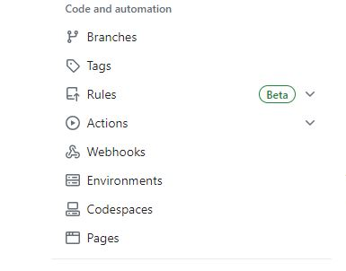
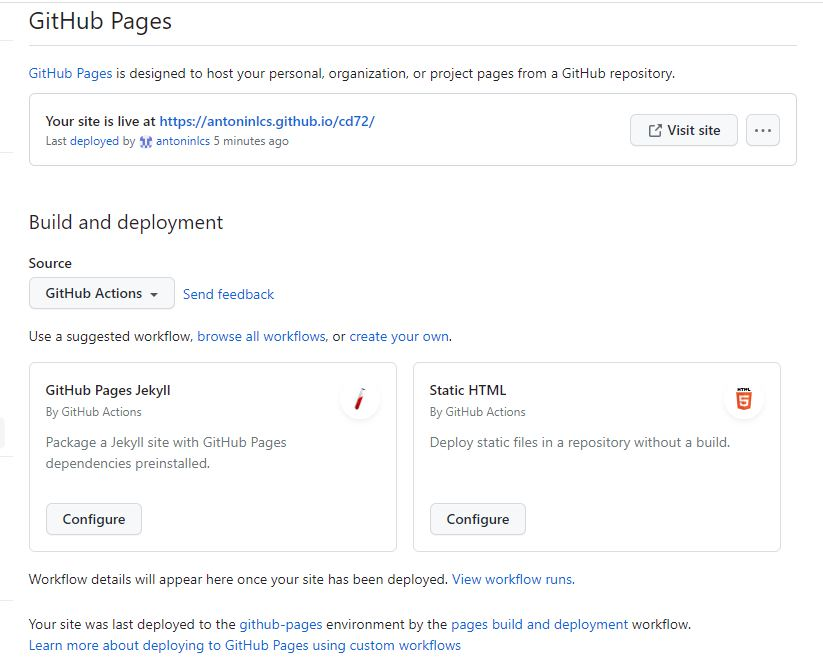
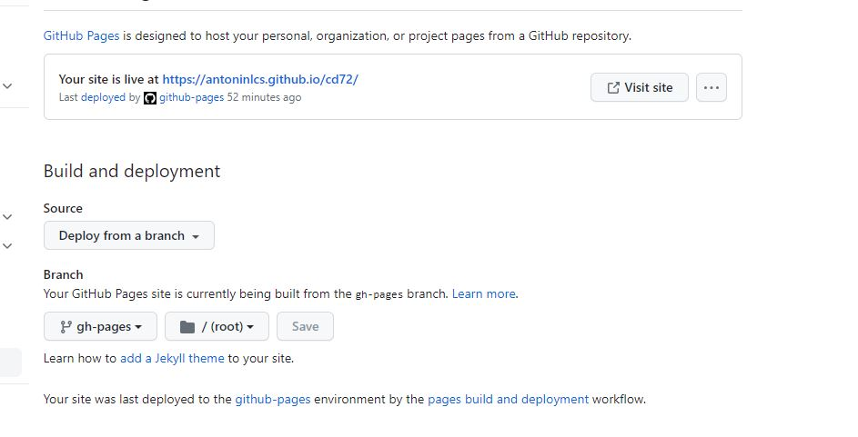
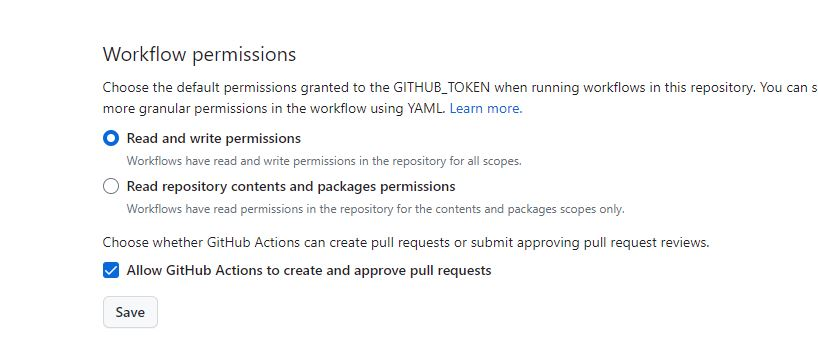

# Création d'un dépôt GITHUB pour héberger mon Portfolio

## Comment créer un dépôt GITHUB :

Tout d'abord, il faudra vous rendre sur ce site : [GITHUB](https://github.com/)

Il faudra vous connecter avec vos codes fournis au préalable :

Une fois connecté, il faudra **Cliquer sur "new" en haut à droite de la page** :

Ensuite, renseignez les informations suivantes :

**Voilà votre dépôt GITHUB créé !!**

## Activer la page web :

Allez dans l'onglet **"settings"** 

Puis allez dans l'onglet **pages** :

Vous devriez arriver sur cet onglet : 

## Création du fichier "ci.yml"

**Ce fichier est un script qui permet de construire et de déployer son site automatiquement.**

Pour ce faire :

~~~bash
mkdir .github
mkdir workflows
vim ci.yml
~~~

Ensuite, il faudra inscrire ceci dans le fichier :

~~~yaml
name: Deploy to GitHub Pages

on:
  push:
    branches:
      - main

jobs:
  deploy:
    runs-on: ubuntu-latest

    steps:
      - name: Checkout repository
        uses: actions/checkout@v2

      - name: Set up Python
        uses: actions/setup-python@v2
        with:
          python-version: 3.x

      - name: Install dependencies
        run: |
          pip install mkdocs mkdocs-material mkdocs-mermaid2-plugin

      - name: Build site
        run: mkdocs build --verbose --clean

      - name: Deploy to GitHub Pages
        uses: peaceiris/actions-gh-pages@v3
        with:
          github_token: ${{ secrets.GITHUB_TOKEN }}
          publish_dir: site
~~~
# ** Attention **

**Il faudra penser à mettre le déploiement dans la bonne branche.**

Pour ce faire, allez dans **"settings"**

Puis allez sur l'onglet **"pages"** :

Ensuite, sélectionnez github action :

et vous allez mettre **"Deploy from a branch"** :

# ** Attention **

**Il faudra penser à mettre les bons droits pour les workflows.**

Pour ce faire, allez dans **"settings"**

Ensuite, allez dans l'onglet **"actions"** :

Ensuite, il faudra descendre jusqu'à trouver ceci : 

Cochez les mêmes choses que moi !

**N'oubliez pas de "save".**

**Voilà, le dépôt est prêt à être utilisé !!!**
