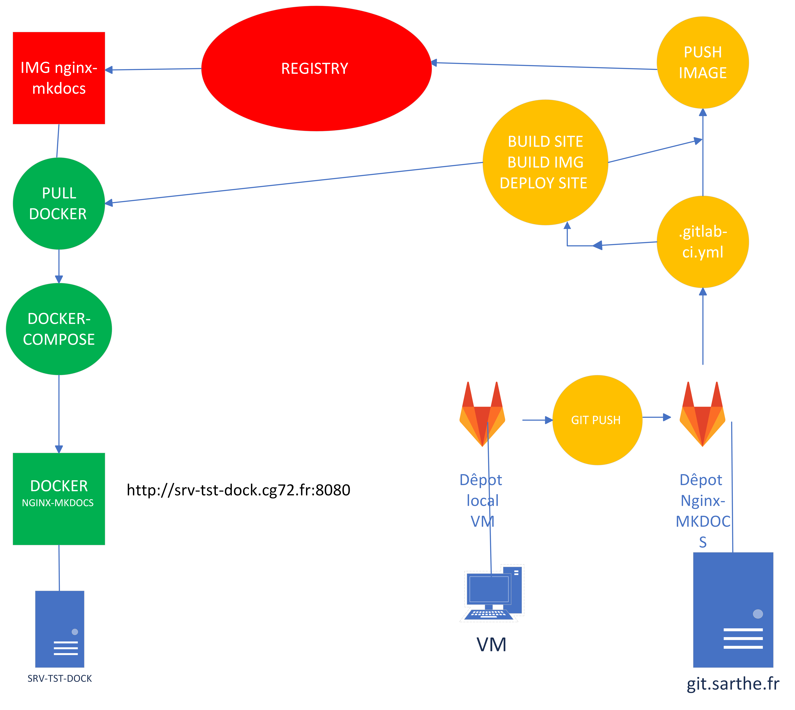

# Le déploiement continue avec docker 

## Le contexte 

J'était en stage au sein du service informatique du Conseil départemental du département de la Sarthe.

## Objectif 

L'objectif de cette mission était d'explorer et de tester une intégration continue pour pouvoir déployer leur application métier.

## Réalisation

Vous pouvez voir comment j'ai réaliser ceci grâce à ma documentation :

**Voir dans /StageCD72/Documentation**

Et aussi j'ai réaliser ce schéma pour essayer de mieux comprendre le processus.

## Compétences acquises

**1.4 : Travailler en mode projet**

**1.6 Organiser son développement professionnel**

**1.5 Mettre à disposition des utilisateurs un service informatique**