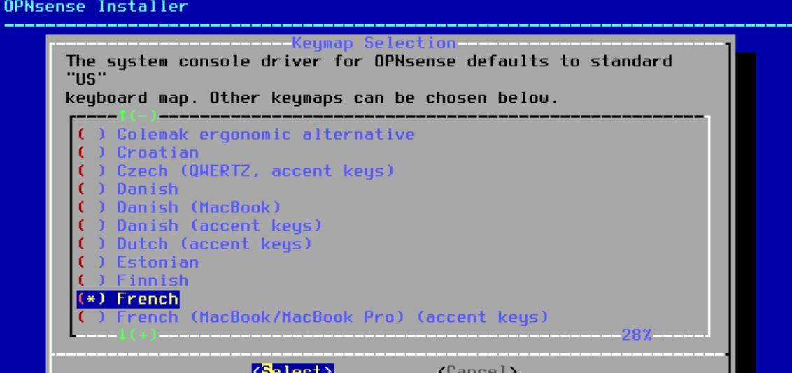
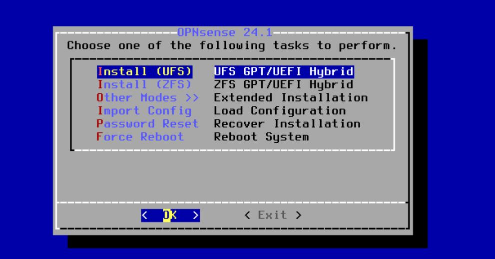
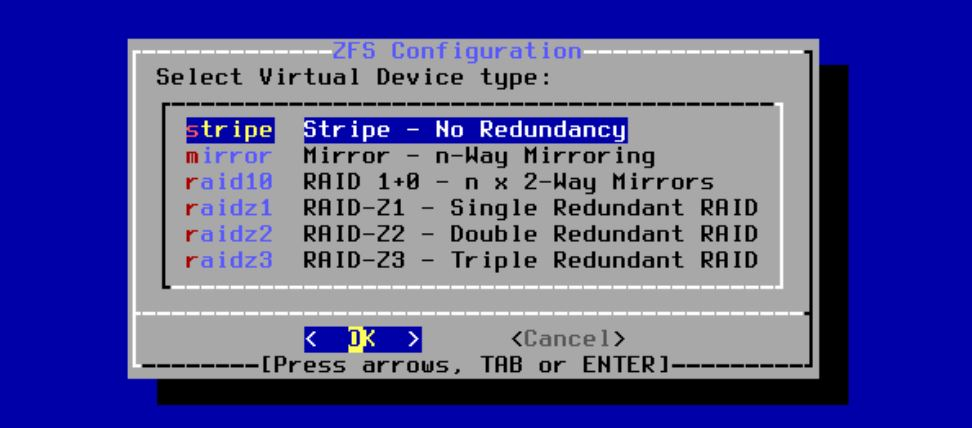
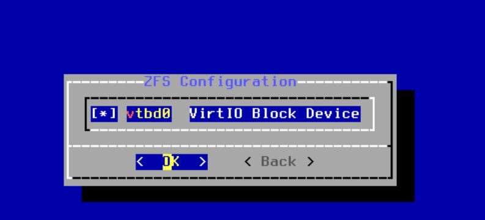
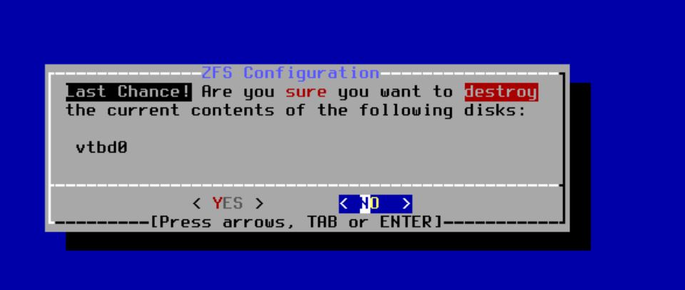
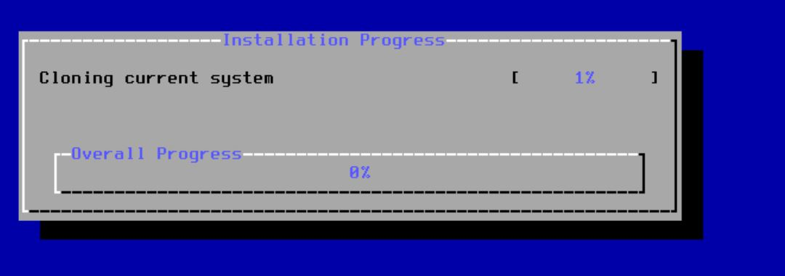
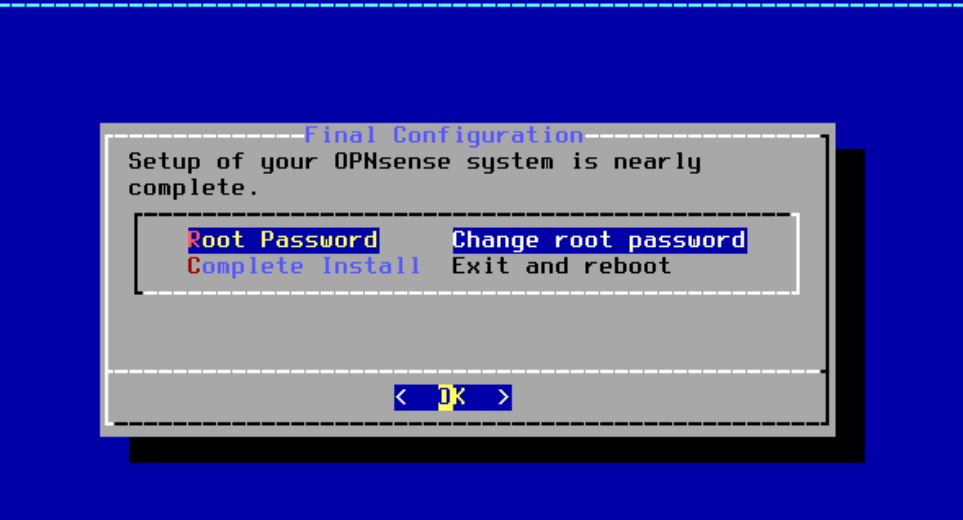
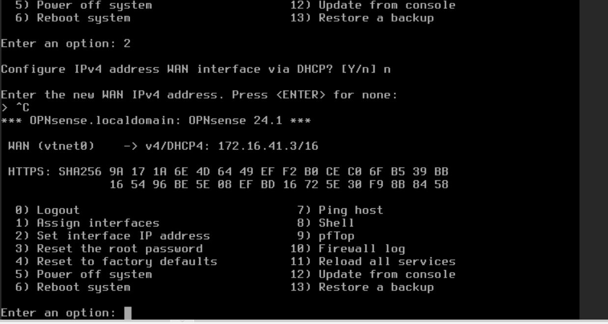

# Installation d'OPNsense 

## L'ISO 

On commence par récupérer l’ISO disponible sur leur site officiel afin de pouvoir installer OPNsense. Pour ma part, j’ai pris la version DVD étant donné que je vais l’installer sur une VM

[Lien Iso OPNSense](https://mirror.vraphim.com/opnsense/releases/24.1/OPNsense-24.1-dvd-amd64.iso.bz2)

Ce fichier devra être **décompresser**

## Installation d'OPNSense 

Quand vous aurez démarrer votre machine vous allez vous configurer l'interface wan pour démarrer l'installation

Une fois cela fais connectez-vous comme ceci : 

~~~bash

login : installer 
mdp : opnsense 
~~~

Attention le clavier est en **qwerty** 

Une fois connecter vous verrez cette fenêtre s'afficher : 

Il faudra choisir le clavier **French**

Ensuite validez cette option 

Une fois cela valider vous verez afficher ceci : 

Vous allez choisir l'option **ZFS**

Choisissez l'option qui vous convient 

Ensuite, il vous proposera un disque sur lequel faire ceci :

Cliquez sur **espace** et ensuite faite **entrée**

Ensuite faites **yes** et **entrée**

Ensuite, il va falloir attendre :

Une fois ceci fini, il vous proposera soit de changer de mot de passe où de finir l'install 

Enfin la machine, va reboot et votre installation de base d'OPNsense sera terminé

Ensuite, il va falloir configurer vos interfaces avec les options 1 et 2 

