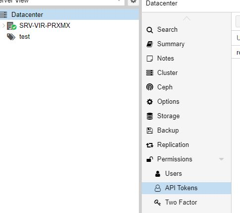
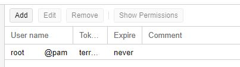
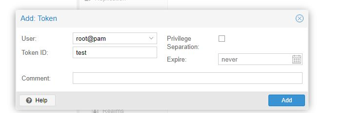
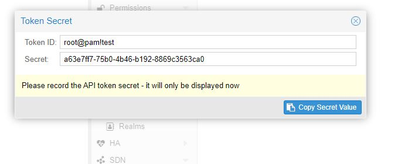

# Pourquoi créer des templates

Il vous faut crée des templates dans prmox car l'outil cloud-init est compatible qu'en faisant des clones c'est pour cela qu'il faudra créer des templates

## Installer images cloud
Ceci ce fait avec quelques lignes de commandes : 

Tout d'abord il faudra vous connecter en ssh sur votre **serveur proxmox**

Ensuite il faudra télécharger une image cloud de votre disbutrion de votre choix 

Il faudra prendre la version de votre choix 

Il faudra prendre en **.img** ou **qcow2**

exemple : [lien cloud ubuntu](https://cloud-images.ubuntu.com/)
        : [Lien cloud debian](https://cloud.debian.org/images/cloud/bullseye/daily/latest/)   

### Notes 

Pour l'installer faites un wget + **le lien de l'image cloud**

~~~bash 

wget https://cloud-images.ubuntu.com/jammy/current/jammy-server-cloudimg-amd64.img

~~~

Ensuite il faudra installer une **blibliothèque** pour l'agent :

~~~bash 

 apt install guestfs-tools

~~~

Une fois installer il faudra installer le **qemu-guest-agent** pour cela faites : 

~~~bash 

virt-customize -a nom_de_l'image_telecharger --timezone Europe/Paris --install qemu-guest-agent --run-command 'systemctl enable qemu-guest-agent.service'

~~~

Il est aussi possible de réduire votre disque où se trouvera l'image je conseille fortement 5G au minimum 

~~~bash 

qemu-img resize --shrink nom_de_l'image_telecharger 5G

~~~
Il est temps de créer votre template.

## Création de la template

Pour cela faites : 

~~~bash

9000 = ID de la machine 

net 0 virtio,bridge=vmbr0 = interface réseau

name = le nom de la machine 

memory = la mémoire 

ciupgrade = 0 : Cela sert a desactivé la mise à jour des paquets a chaque boot de la machine 

 qm create 9000 --name nom_de_votre_vm --memory 2048 --cores 2 --ciupgrade 0 --net0 virtio,bridge=vmbr0

~~~

Ensuite vous devrez importer le disque sur votre stockage :

~~~bash 

 qm importdisk 9000 nom_de_l'image_telecharger pve-data

~~~

Ensuite, il faudra attacher le disque a la vm comme disque virtio

~~~bash 

 qm set 9000 --virtio0 pve-data:vm-9000-disk-0

~~~

Ajout d'un disque de type cloud-init : 
 
~~~bash 

 qm set 9000 --ide2 pve-data:cloudinit

~~~

Ensuite faudra indiquer a la template le boot :

~~~bash

qm set 9000 --boot c --bootdisk virtio0
~~~

Ensuite pour éviter d'avoir un écran noir sur la template il faut faire cette commande :

~~~bash 

 qm set 9000 --serial0 socket --vga serial0

~~~

Ensuite il faudra activé l'agent 

~~~bash

 qm set 9000 --agent enabled=1

~~~

Pour finir il vous suffira de la convertir en template

~~~bash

 qm template 9000

~~~

# Attention 

- N'oubliez pas si vous avez plusieurs template mettre un ID différent  
  
# Création du projet terraform 

Tout d'abord, il faudra installer terraform sur votre machine 

Il y aura quelques a effectuer tout d'abord assurez-vous que votre système est à jour et que vous avez installé les packages **gnupg**, **software-properties-commonet** installés **.curl**. Vous utiliserez ces packages pour vérifier la signature GPG de HashiCorp et installer le référentiel de packages Debian de HashiCorp :

~~~bash 

 sudo  apt-get update &&  sudo  apt-get  install -y gnupg software-properties-common

 ~~~

Ensuite, Installez la **clé GPG HashiCorp**.

 ~~~bash 

wget -O- https://apt.releases.hashicorp.com/gpg |  \
gpg --chermor |  \ 
sudo  tee /usr/share/keyrings/hashicorp-archive-keyring.gpg

~~~

La commande **gpg** rapportera l'empreinte de la clé 

Puis, ajoutez le référentiel officiel HashiCorp à votre système. La commande **La lsb_release -cs** recherche le nom de code de la version de distribution de votre système actuel, tel que **buster**, **groovy** ou **id**.

~~~bash 

 echo "deb [signed-by=/usr/share/keyrings/hashicorp-archive-keyring.gpg] \
https://apt.releases.hashicorp.com $(lsb_release -cs) main" | \
sudo tee /etc/apt/sources.list.d/hashicorp.list

~~~

Maintenant, il faudra mettre a jour vos paquets 

~~~bash 

sudo apt-get update

~~~

Enfin vous pourrez installer **Terraform**

~~~bash 

 sudo  apt-get  install terraform

~~~

# Création de l'API JETON PROXMOX

Tout d'abord, allez sur votre proxmox : **http://ip_de_votre_machine:8006**

Ensuite, allez sur l'onglet **API Tokens**

Puis, cliquez sur **Add** 

Vous aurez cette fenêtre apparaître : 

- Renseigner l'utilisateur associé a ce jeton 
- Lui mettre un nom (ID)
- Décocher **Privilege Separation**
- Faites **add**

Une cela fait vous verrez cette fenêtre apparaitre :

**NOTEZ CES INFORMATIONS QUELQUES PART CAR VOUS EN AUREZ BESOIN ET CES INFORMATIONS NE PEUVENT PAS ETRE RELUE PLUSIEURS FOIS**

# Création des fichier terraform 

Tout d'abord créer un fichier automatisation dans lequel vous mettrez un dossier ansible et terraform.
Concentrons-nous sur le dossier terraform vous devrez créer 3 dossiers :

- credential.auto.tvars ( Pour les infos sensible )
- providers.tf ( Pour que terraform accède à proxmox )
- main.tf (Le fichier qui va cloner et configurer votre vm)
- variable.tf ( Le fichier pour déclarer vos variables)
- D'un dossier modules

Créer vos fichier sur vscode se sera plus pratique

[lien connection ssh](http://srv-tst-dock.cg72.fr:8080/Doc_stage_2023/GITLAB/)

Ce lien vous explique comment connecter votre machine en ssh sur vscode

Ensuite vous aller créer un premier fichier confidentiel qui va permettre de stocker le lien de votre proxmox ainsi que les informations de votre API TOKEN

Pour cela nommez ce fichier "credentials.auto.tfvars"

~~~bash 

proxmox_api_url = "http://ip_de_votre_machine:8006/api2/json"
proxmox_api_token_id = "Votre ID jeton"
proxmox_api_token_secret = "Votre sercret"

~~~

Une fois cela fait faites **contol+s**

Ensuite créer un fichier **provider.tf** : 

Il faudra mettre ces informations : 

~~~bash 

# Configuration de Terraform et spécification des versions des fournisseurs requis
terraform { 
  required_providers {
    proxmox = {
      source  = "TheGameProfi/proxmox"
      version = "2.9.16"
    }
  }
}

# Fournisseur Proxmox avec les détails d'authentification
provider "proxmox" {
  pm_api_url           = var.proxmox_api_url
  pm_api_token_id      = var.proxmox_api_token_id
  pm_api_token_secret  = var.proxmox_api_token_secret
  pm_tls_insecure      = true    # Désactive la vérification TLS pour les connexions (utilisé dans les environnements de test)
  pm_debug             = true    # Active le mode débogage pour le fournisseur Proxmox
}
~~~

Ce fichier va permettre a terraform de joindre l'api de proxmox

Puis, il faudra créer un dernier fichier qui va permettre de configurer votre vm 

Il s'appelera généralement **main.tf**

Voici ce qu'on peut retrouver dans ce fichier 

~~~bash 

module "serveurs-vm" {
    source = "./modules/serveurs-vm" #nom du module 
    count = 1 # Nombre de vm crée 
    vm_ip = "172.16.99.${count.index + 2}" # Variable qui change par rapport au main du module 
    vm_name="srv-anto-${count.index + 2}" # Variable qui change  par rapport au main du module 

~~~

Enfin, Il faudra créer un dossier variables.tf qui vous permettra de rensigner différentes variables pour que terraform puisse accèder a Terraform 

Voici ces information : 

~~~bash 

variable "proxmox_api_url" {
    type = string 
}

variable "proxmox_api_token_id" {
    type = string
    sensitive = true 
}

variable "proxmox_api_token_secret" {
    type = string 
    sensitive = true   
}
~~~

## Le dossier module

Les modules sert a créer des main.tf et variable.tf pour chaque sorte de vm ( ex: un module pour créer des serveurs et un autre pour créer des postes client)

Ensuite il y a le main.tf qu'on a vu ci-dessus qui lui va reprendre le main.tf du modules mais dans lequel on va pouvoir modifier des informations sans toucher au main.tf du module

### Création de variables.tf 

Dans ce fichier vous allez renseigner toutes les variables necessaire a votre configuration de votre vm 

Voici un exemple : 

~~~bash 

variable "proxmox_node" {
    type = string
    default = "Nom de votre noeud"
    sensitive = true
}

variable "vm_pool" {
 type = string
 default = "test"
 description = "pool de la vm"
}

variable "vm_clone" {
 type = string
 default = "sdn-tmplt"
 description = "nom du modele"
}
variable "vm_sockets" {
 type = number
 default = 1
 description = "nombre de socket"
}
variable "vm_cores" {
 type = number
 default = 2
 description = "nombre de core"
}
variable "vm_memory" {
 type = number
 default = 2048
 description = "RAM"
}

variable "vm_name" {
 type = string
 default = "vm-test-anto-"
 description = "nom de la vm"
}

variable "vm_ip" {
 type = string
 default = "Vos 3 premiers octets de votre plage ip "
 description = "ip de la vm"
}

variable "vm_gw" {
 type = string
 default = "Votre gateway "
 description = "gw vm"
}

variable "vm_dns" {
 type = string
 default = "Vos dns"
 description = "dns de la machine"
}

variable "vm_domain" {
 type = string
 default = "cg72.fr"
 description = "nom dns de la machine"
}

variable "pubkeys" {
 type = string
 default =  <<EOF

Votre Clef pub 
}

~~~

#### Notes 

Pour la variable Ip il y a que 3 octets car il y a le **count.index** qui va lui attribué le dernier selon la valeurs qu'on a renseigné après le +. Cela est utile quand vous allez créer plusieurs vm 

### Le fichier main.tf 

Ce fichier va vous permettre de configurer les bases de votre vm 

Voici un exemple : 

~~~bash 

terraform {
  required_providers {
    proxmox = {
      source  = "TheGameProfi/proxmox"
      version = "2.9.16"
    }
  }
}

resource "proxmox_vm_qemu" "vm-multi" {

  target_node = "${var.proxmox_node}"

  clone      = "${var.vm_clone}"
  pool       = "${var.vm_pool}"
  name       = "${var.vm_name}"
  vmid = "200"

  sockets    = "${var.vm_sockets}"
  cores      = "${var.vm_cores}"
  memory     = "${var.vm_memory}"

  cipassword   = "root"

  agent      = 1
  os_type    = "cloud-init"

  ipconfig0    = "ip=${var.vm_ip}/16,gw=${var.vm_gw}"
  nameserver = "${var.vm_dns}"
  searchdomain = "${var.vm_domain}"

}

~~~