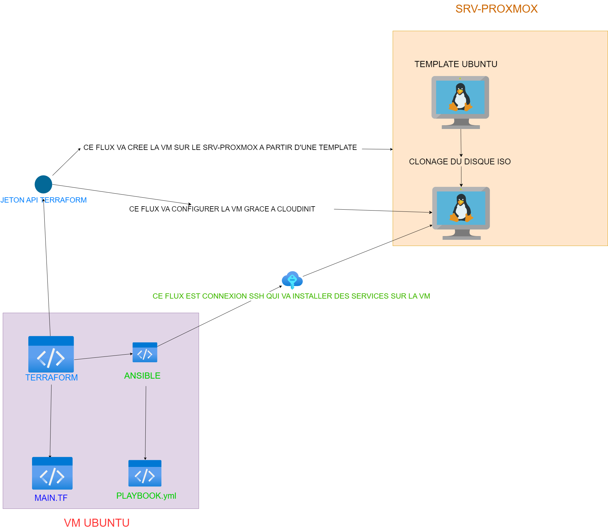

# Déploiement de vm automatique avec terraform proxmox et ansible 

## Le contexte 

Le besoin initial du département était de pouvoir réalisé des environnements de test identique à l'environnement de production. Il voulait aussi automatisé leur déploiement de machines virtuelles avec tout qui est déja installé d'où le besoin d'utilisé ansible qui va permettre d'installé les services nécessaires à l'ultiler de la VM

## Objectif 

L'objectif de cette mission était de déployer des environnements de tests qui ressemblent a des environnement de production automatiquement

## Réalisation

Tout d'abord, j'ai monter un cahier des charges pour nous fixer des objectifs et définir les besoins, j'ai pu ensuite travailler avec le service sécurité et les administrateurs réseaux pour réaliser a bien mon projet.

Vous pouvez voir comment j'ai réaliser ceci grâce à ma documentation :

**Voir dans /Stage 2024 CD72/Documentation**

Et aussi j'ai réaliser ce schéma pour essayer de mieux comprendre le processus.

## Compétences acquises

**1.4 : Travailler en mode projet**

**1.5 Mettre à disposition des utilisateurs un service informatique**